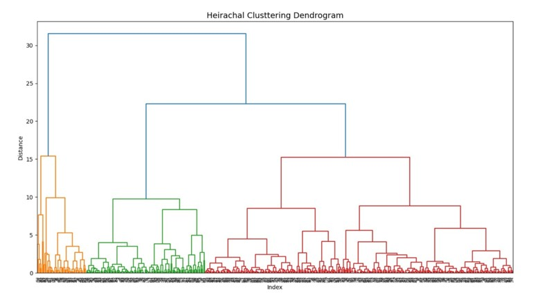
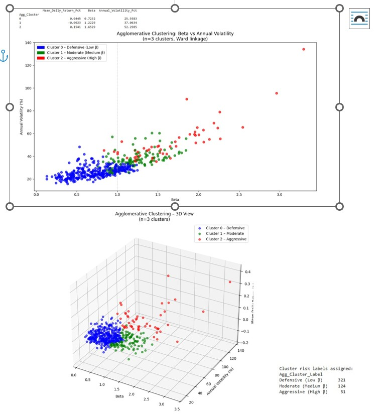
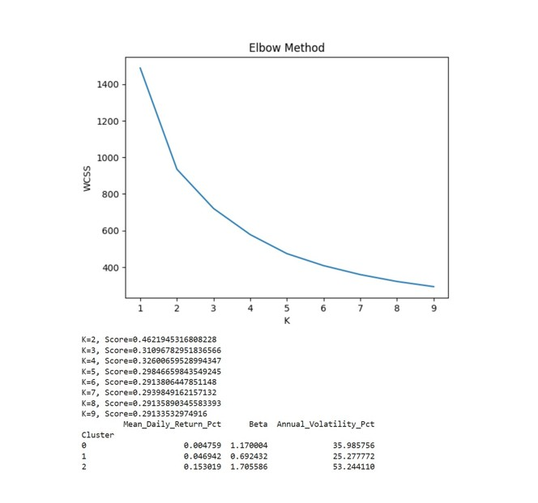
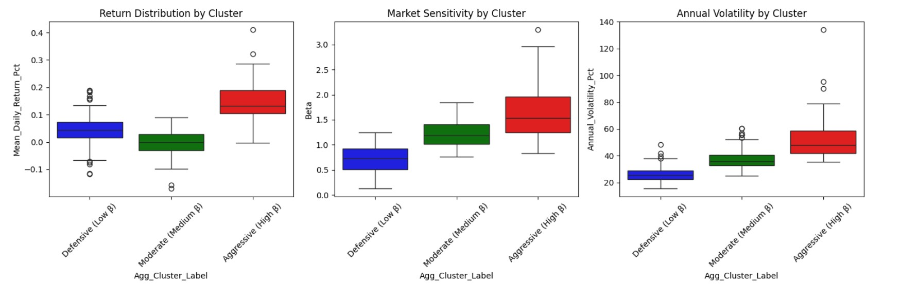

7BUIS010W.2 Data Warehousing and Business Intelligence Coursework

Project Overview:
This project leverages Python-based data analytics and machine learning to segment S&P 500 stocks based on their risk-return profiles. By calculating Beta, Annual Volatility, and Mean Daily Returns, we categorize 496 stocks into three distinct investment regimes (Defensive, Moderate, and Aggressive).
The goal is to provide a Business Intelligence framework that supports automated investment advice and ESG-aligned portfolio management within a Fintech context.

HOW TO RUN

1. Open [final_code.ipynb) in Google Colab.
2. Install dependencies: `!pip install yfinance` in the first cell.
3. Run all cells to replicate the data extraction and clustering results.

You can view the full analytical report here: [Final_Report.pdf](Final_Report.pdf)

# Hierarchical Dendrogram

# Agglomerative Clustering

# Elbow Graph

# Statistical Distribution (Boxplots)

Data ETL: Extraction of 3 years of market data using the Yahoo Finance API.
Feature Engineering: Calculation of financial risk metrics and data normalization using StandardScaler.
Clustering Analysis: Agglomerative Hierarchical Clustering (Ward’s Linkage) to find natural groupings.
K-Means Clustering validated by Elbow Method and Silhouette Scores.
BI Integration: Proposed Star Schema for a Data Mart and a strategic report on CRM sustainability.

Key Visuals:
Dendrogram: Justifies the selection of N=3 clusters using Ward's linkage.

3D Risk Map: Visualizes how Cluster 2 (Aggressive) separates from the market core based on Beta.

Boxplots: Demonstrates the statistical "spread" of each group, confirming that Cluster 0 has the lowest variance.Language: Python 3.x (Google Colab)

Libraries: 
yfinance, scikit-learn, pandas, matplotlib & seaborn, seaborn, scipy, silhouette_score, StandardScaler, numpy

BI Tools: 
Star Schema Design, CRM Sustainability Framework
